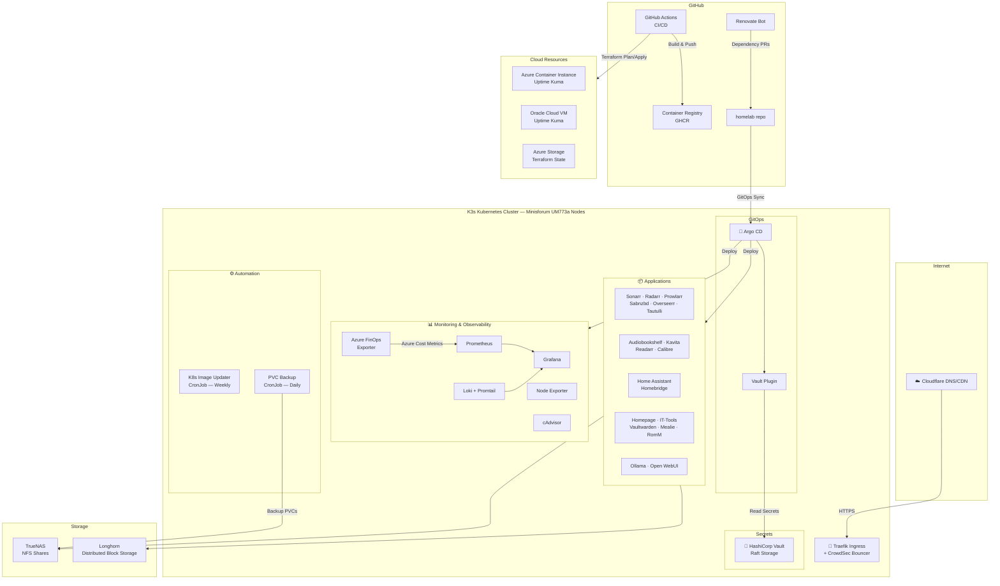

<div align="center">

# 🏠 Homelab

**Production-grade Kubernetes home infrastructure managed with GitOps, Infrastructure as Code, and full observability.**

[](https://argoproj.github.io/cd/)
[](https://k3s.io/)
[](https://www.terraform.io/)
[](https://prometheus.io/)
[](https://grafana.com/)
[](https://www.vaultproject.io/)
[](https://renovatebot.com/)
[](https://github.com/features/actions)

</div>

---

<div align="center">
  
  <br/>
  <em>The physical homelab — Minisforum UM773a mini PCs, TrueNAS, and networking gear</em>
</div>

---

## 📋 Overview

This repository contains the complete infrastructure-as-code for my homelab — a multi-node K3s Kubernetes cluster running 30+ services, backed by GitOps continuous delivery, automated secret management, full-stack observability, and Terraform-managed cloud resources.

**Key highlights:**
- **GitOps-driven** — Argo CD automatically syncs all Kubernetes workloads from this repo with self-healing and auto-pruning
- **Secrets managed in Vault** — HashiCorp Vault with Kubernetes auth, injected via Argo CD Vault Plugin (AVP)
- **Full observability** — Prometheus, Grafana, Loki + Promtail, Node Exporter, cAdvisor
- **IaC everywhere** — Terraform manages Cloudflare DNS, Oracle Cloud, and Azure infrastructure
- **CI/CD with drift detection** — GitHub Actions pipelines with scheduled drift checks that auto-create issues
- **Security-first** — CrowdSec WAF, Azure OIDC (no stored credentials), tfsec scanning, Vaultwarden

---

## 🏗️ Architecture



---

## ⚙️ Tech Stack

| Layer | Technologies |
|:------|:-------------|
| **Kubernetes** | K3s, Kustomize, Longhorn, MetalLB/kube-vip |
| **GitOps** | Argo CD v3.2.6, Argo CD Vault Plugin |
| **Infrastructure as Code** | Terraform (Cloudflare, Oracle Cloud, Azure, Proxmox providers) |
| **CI/CD** | GitHub Actions (self-hosted + cloud runners), Renovate Bot, Docker Buildx, GHCR |
| **Monitoring** | Prometheus v3.5.1, Grafana v12.3.1, Loki v3.6.4, Promtail, Node Exporter, cAdvisor |
| **Security** | HashiCorp Vault, CrowdSec WAF, tfsec, Vaultwarden, Azure OIDC |
| **Networking** | Traefik, Cert-Manager, Cloudflare DNS/CDN, NordLynx VPN |
| **Config Management** | Ansible (Linux, Windows, MiSTer FPGA) |
| **Containers** | Docker, Docker Compose |
| **Storage** | TrueNAS (NFS), Longhorn (distributed block) |
| **Virtualization** | Proxmox VE |
| **Cloud** | Azure (Container Instances, Storage, Cost Management), Oracle Cloud (free-tier) |
| **AI/ML** | Ollama, Open WebUI (GPU passthrough) |

---

## 🖥️ Hardware

| Node | Role | Hardware |
|:-----|:-----|:---------|
| bd790i | Proxmox Host | — |
| bd795m | Proxmox Host | — |
| um773a | K3s Worker | Minisforum UM773a |
| um773b | K3s Worker | Minisforum UM773a |
| um773c | K3s Worker | Minisforum UM773a |
| — | NAS | TrueNAS (NFS) |

---

## 📂 Repository Structure

```
homelab/
├── 📂 .github/workflows/     # CI/CD pipelines (Docker deploy, Terraform, container builds)
├── 📂 ansible/                # Playbooks for Linux, Windows, and MiSTer FPGA updates
├── 📂 apps/                   # Custom applications (Azure FinOps Exporter)
├── 📂 argocd/                 # Argo CD Application manifests
├── 📂 azure-uptimekuma/       # Terraform — Azure Container Instance for Uptime Kuma
├── 📂 cheat-sheets/           # Command references for Docker, K8s, Powershell, etc.
├── 📂 compose/                # Docker Compose stack for host-level services
├── 📂 dockerfiles/            # Custom container images
├── 📂 docs/                   # Operational runbooks and upgrade guides
├── 📂 Helm/                   # Helm values for Traefik, Cert-Manager
├── 📂 helm/                   # Helm values for CrowdSec
├── 📂 kubernetes/             # 31 Kustomize-based app manifests (the core of the repo)
│   ├── argocd/                # Argo CD + Vault Plugin
│   ├── prometheus/            # Prometheus with K8s service discovery
│   ├── grafana/               # Grafana with provisioned dashboards + datasources
│   ├── loki/                  # Loki + Promtail log aggregation
│   ├── vault/                 # HashiCorp Vault with Raft storage
│   ├── homepage/              # Dashboard with live API widgets
│   └── ...                    # 25 more application directories
├── 📂 scripts/                # Vault helpers, volume management
├── 📂 terraform/              # IaC for Cloudflare DNS, Oracle Cloud, Proxmox
│   ├── cloudflare-dns/        # 20+ DNS records for tehmatt.com
│   ├── oracle-uptimekuma/     # Free-tier OCI VM provisioning
│   └── proxmox-um773a/        # Proxmox VM management
└── 📂 training/               # Certification notes and resources
```

---

## 🔄 GitOps Workflow

```
Developer pushes to main
        │
        ▼
┌─────────────────┐     ┌──────────────────┐
│  GitHub Actions  │────▶│  Lint / Scan /   │
│  (CI Pipeline)   │     │  Build / Push    │
└─────────────────┘     └──────────────────┘
        │
        ▼
┌─────────────────┐     ┌──────────────────┐     ┌──────────────────┐
│    Argo CD       │────▶│  Vault Plugin    │────▶│  K3s Cluster     │
│  (Auto-Sync)     │     │ (Secret Inject)  │     │  (Deployment)    │
└─────────────────┘     └──────────────────┘     └──────────────────┘

• Self-healing enabled — Argo CD reverts manual cluster changes
• Auto-pruning enabled — removed manifests are cleaned up automatically
• Renovate Bot opens PRs for dependency updates weekly
```

---

## 📦 Kubernetes Services

### Media & Entertainment
| Service | Description |
|:--------|:------------|
| Sonarr | TV show management and automation |
| Radarr | Movie management and automation |
| Prowlarr | Indexer management for Sonarr/Radarr |
| Sabnzbd | Usenet download client |
| Overseerr | Media request management |
| Tautulli | Plex analytics and monitoring |
| Audiobookshelf | Audiobook and podcast server |
| Kavita | eBook/manga reading server |
| Readarr | Book management and automation |
| Calibre | eBook library management |
| RomM | ROM library manager |

### Home Automation
| Service | Description |
|:--------|:------------|
| Home Assistant | Central home automation hub |
| Homebridge | HomeKit bridge for non-native devices |

### Utilities & Productivity
| Service | Description |
|:--------|:------------|
| Homepage | Unified dashboard with live API widgets |
| IT-Tools | Developer/sysadmin utility collection |
| Vaultwarden | Self-hosted Bitwarden password manager |
| Mealie | Recipe manager and meal planner |

### AI / Machine Learning
| Service | Description |
|:--------|:------------|
| Ollama | Local LLM inference engine |
| Open WebUI | ChatGPT-style interface for Ollama |

### Monitoring & Observability
| Service | Description |
|:--------|:------------|
| Prometheus | Metrics collection with K8s service discovery |
| Grafana | Dashboards and visualization |
| Loki + Promtail | Log aggregation and search |
| Node Exporter | Host-level hardware/OS metrics |
| cAdvisor | Container resource metrics |
| Plex Exporter | Plex media server metrics |
| Azure FinOps Exporter | Custom Azure cost tracking with budget alerts |
| Dozzle | Real-time container log viewer |

---

## ☁️ Terraform-Managed Infrastructure

| Project | Provider | Purpose |
|:--------|:---------|:--------|
| `cloudflare-dns/` | Cloudflare | DNS management for 20+ subdomains on `tehmatt.com` |
| `oracle-uptimekuma/` | Oracle Cloud | Free-tier VM for external uptime monitoring |
| `azure-uptimekuma/` | Azure | Container Instance for redundant uptime monitoring |
| `proxmox-um773a/` | Proxmox | VM provisioning on Minisforum hardware |

All Terraform state is stored in **Azure Storage** with **OIDC authentication** (no stored credentials).

---

## 🚀 CI/CD Pipelines

| Workflow | Trigger | What It Does |
|:---------|:--------|:-------------|
| **Docker Compose Deploy** | Push to `compose/` | Auto-deploys via self-hosted runner |
| **Azure FinOps Build** | Push to `apps/` | Lint → Type check → Hadolint → Multi-arch build → GHCR push |
| **Azure Uptime Kuma** | Daily + PRs | tfsec scan → OpenTofu drift detection → Auto-creates issues on drift |
| **Cloudflare DNS** | Push + Daily | Terraform plan/apply, PR comments with plans, drift alerting |

---

## 🔐 Security

- **HashiCorp Vault** — Centralized secrets with Kubernetes auth, injected at deploy time via AVP
- **CrowdSec** — Community-driven WAF with Traefik bouncer plugin, 4-hour auto-ban
- **Azure OIDC** — Federated identity for CI/CD, no stored cloud credentials
- **tfsec** — Infrastructure security scanning in CI pipelines
- **Vaultwarden** — Self-hosted password management
- **Cert-Manager** — Automated TLS certificate provisioning via Let's Encrypt
- **NordLynx VPN** — WireGuard tunnel for download client traffic

---

## 📊 Automation & Maintenance

| Tool | Function |
|:-----|:---------|
| **Renovate Bot** | Automated dependency update PRs |
| **K8s Image Updater** | Weekly CronJob checking for container image updates |
| **PVC Backup** | Daily CronJob backing up persistent volumes to NFS |
| **Ansible Playbooks** | OS updates for Linux servers, Windows machines, and MiSTer FPGA |
| **Drift Detection** | Scheduled Terraform plans that auto-create GitHub Issues on infrastructure drift |

---

## 🛠️ Getting Started

This repo is specific to my infrastructure, but the patterns are reusable. Key concepts:

1. **GitOps with Argo CD** — Every K8s manifest in `kubernetes/` is automatically deployed
2. **Kustomize organization** — Each app has its own directory with `kustomization.yaml`
3. **Secret injection** — Files ending in `.avp.yaml` are processed by Vault Plugin at deploy time
4. **Terraform separation** — Each cloud provider/project gets its own state and directory

---

## 📝 Documentation

- [Longhorn Upgrade Guide](docs/longhorn-upgrade-v1.10.2.md)
- [Azure FinOps Exporter](apps/azure-finops-exporter/README.md)
- [Azure Uptime Kuma Monitoring](azure-uptimekuma/MONITORING.md)
